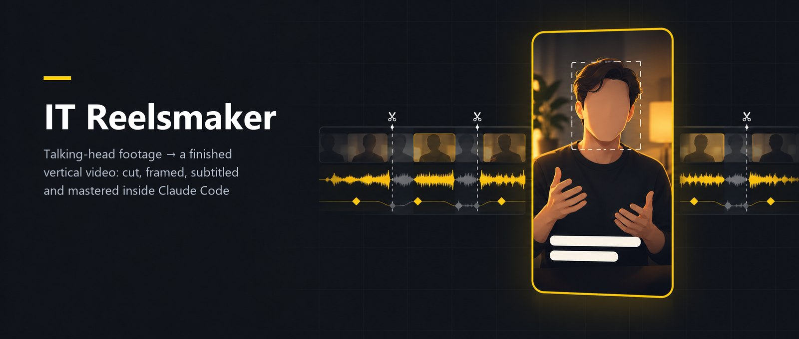

# IT Reelsmaker — Claude Code plugins for vertical video

This repository is a Claude Code plugin marketplace, `itparty`, with two plugins:

| Plugin | What it does |
|---|---|
| [`it-reelsmaker`](plugins/it-reelsmaker/README.md) | Edits vertical short videos (Reels, Shorts, TikTok) from talking-head footage: cuts pauses and retakes by audio, virtual camera and on-brand graphics in Remotion, word-timed subtitles, face-aware layout, mastering and a 1080×1920 render. Runs locally. |
| [`it-reelsmaker-online`](plugins/it-reelsmaker-online/README.md) | Optional add-on: online stock footage, CC-licensed memes and paid AI video generation for B-roll, each only after you approve the plan. |

## Install

```bash
claude plugin marketplace add https://github.com/itpartypattaya/reels-montage.git
```

```bash
claude plugin install it-reelsmaker@itparty
```

Add the online sources if you want them:

```bash
claude plugin install it-reelsmaker-online@itparty
```

Requirements, settings, examples and what data leaves your computer are in each plugin's README. The core plugin's README is also available [in Russian](plugins/it-reelsmaker/README.ru.md).

## Upgrading from `reels-montage`

Before version 1.0 this repository was a single skill installed by cloning it into `~/.claude/skills/reels-montage`. To upgrade:

1. Install the plugin as above.
2. Move your brand profiles from `~/.claude/skills/reels-montage/brands/<slug>/` to `<your editing project>/brands/<slug>/`. The skill offers to do this the first time it runs.
3. Delete the old clone.

## License

[MIT](LICENSE).
